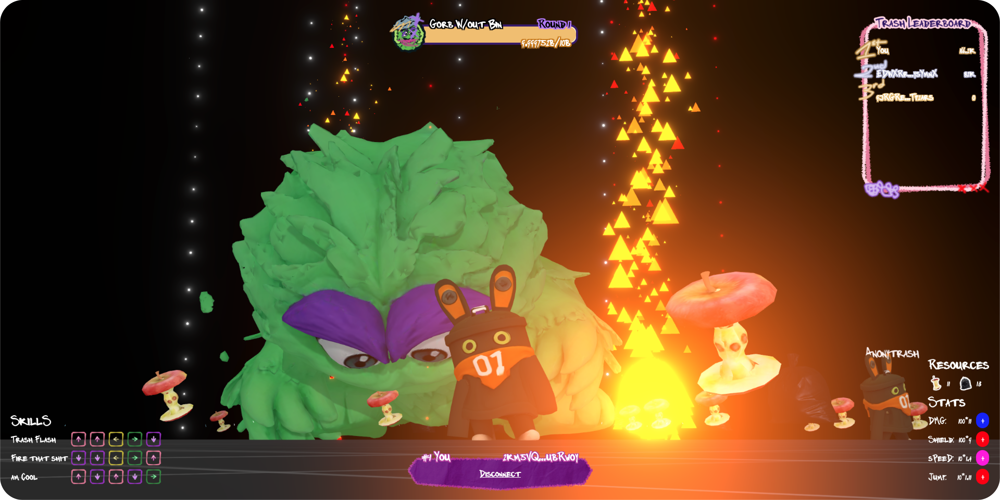

# Goroorog
A 3D multiplayer action onchain game built on Gorbagana Network.
This is a game about GORB, he is getting mad bacause he lost his trash bin. Player need to beat him to calm him down. Collect the trash to increase the stats to get stronger and claim the leaderboard.

## Gameplay
- Player press the Arrow keys in order to cast the skills.
- Player can move around the map and collect the trash.
- Player can use trash to increase the stats.
- All player stats and skills are stored onchain.

## Onchain Program Integration

I build a modular entity system that will store all game state, player progression, and interactions onchain.

### Core Entities

- Players: Represents individual game participants 

- Bosses: Manages boss entities and their progression

- Stats: Player attribute system (health, attack, defense, etc.)

- Skills: Player abilities and combat skills

- Resources: In-game collectible items (trash bags, apples)

- History: Transaction and interaction logging

### Game Flow Integration

1. **Player Onboarding**
   - Wallet connection triggers `create_player()` instruction
   - Initial stats and skills created with base values
   - Starting resources allocated for progression

2. **Gameplay Mechanics**
   - Arrow key skill casting executes onchain skill validation
   - Resource collection updates `Resources` accounts in real-time
   - Combat damage calculations stored in `History` for transparency

3. **Progression System**
   - Players spend collected resources to upgrade stats via `update_stat()`
   - Skill improvements require resource consumption and validation
   - All upgrades are permanently recorded onchain

## Live Demo

https://goroorog.vercel.app/
